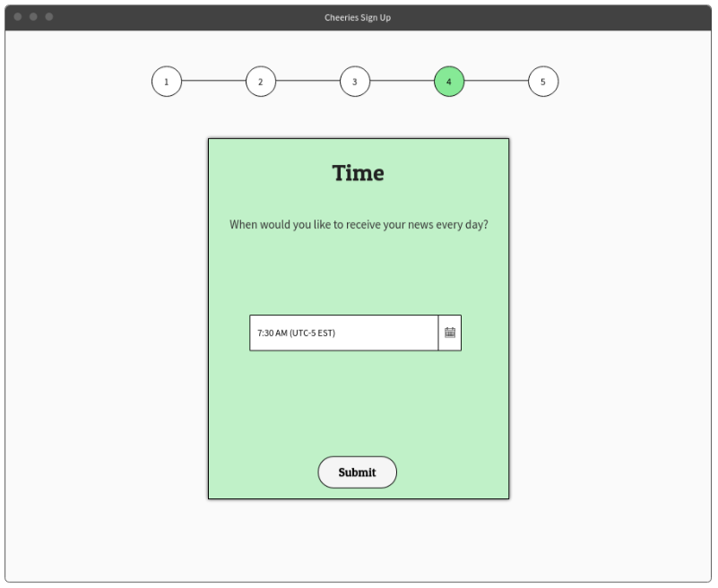

#	Cheeries #

Members: Armanc Keser, Casey Culligan, David Massart, Shihan Li, Kerem San

## Problem statement

Our devices are constantly bombarded with news-related notifications related to current events. Often times, this news is negative, as [it’s been determined that bad news sell](https://www.theguardian.com/commentisfree/2016/apr/21/bad-news-media-misery).
Since recipients of this negative news are exposed to it so often (e.g., through notifications, newsfeeds, and TV screens), it’s essential we consider the emotional impact this has on them and take action to combat any adverse of effects of this [seemingly never-ending exposure to adversity](https://www.huffingtonpost.com/2015/02/19/violent-media-anxiety_n_6671732.html).

### How do you solve the problem?

Our solution to this problem would involve developing a news platform that makes positive news stories prominent in the lives of users. That is, we’d combat people’s bias towards seeking out negative news by presenting users with inspiring stories of strength and progress.
We will use techniques and algorithms (mostly through the use of APIs) that allow us to parse news stories based on user preferences and pick the most positive ones using sentiment analysis. Ultimately, we’d expect the effect of this exposure to inspiring articles on users to carry over [into their personal and professional lives](https://hbr.org/2015/12/proof-that-positive-work-cultures-are-more-productive).

### Features

- [ ] Feature 0: Login and Sign Up buttons/forms.

- [ ] Feature 1: Users will be able to enter their preferences through a questionnaire of sorts, which will 	help us determine which news we want to scrape and present to them. Users can edit these preferences 	 whenever they like. Here are the questions:
		1. What are your interests (around 20 of these)?
			- Politics
			- Tech
			- ...
		2. What time do you want your news to be delivered to you?
			- Allows users to choose a time and a timezone!
		3. Which of the following sources would you like to receive your news from?
			- CNN
			- MSNBC
			- FOX News
			- Vice
			- ...

- [ ] Feature 2: The preferences in features 0 and 1 will need to be stored in a database. We will either use 	MongoDB or MySQL. Since there won't be much data stored (we aren't storing articles), I don't think we 	  need a cloud storage solution. Passwords will be encrypted using SHA-1 or SHA-256 in our database.

- [ ] Feature 3: Parse/Scrape news sources for articles that the user would like, using certain news APIs such 	 as NYT API or Reddit API.

- [ ] Feature 4: Sorting through a list of articles and picking the most positive ones using the VADER API.

- [ ] Feature 5: Displaying articles that were found to the user in a visually-pleasing manner at the exact    	 time specified by the user on our website.

- [ ] Feature 6: Our website (front end). Built using HTML, CSS, JavaScript and most likely a framework (	   	 Bootstrap). We will have different screens before and after login.

## Data Collected and Used

We will be collecting user data (username, emails, passwords (encrypted)) and obviously not be selling this data on the dark web.
- Using this for login.

We will be collecting the user preferences (interests, sources, time for displaying articles).
- Using this to scrape articles.

### Algorithms or special techniques

1. APIs
	- Parsing news
		a. Currently looking at feasibility of NewsApi (contains a lot of news sources), Reddit API, NYT 	API, Diffbot, news-please…
		b. These will help us to parse/scrape the news articles, which we’ll look for based on user 	  	 preferences.
	- Sentiment Analysis
		a. VADER API
		b. "VADER (Valence Aware Dictionary and sEntiment Reasoner) is a lexicon and rule-based sentiment 	 analysis tool that is specifically attuned to sentiments expressed in social media, and works 	   well on texts from other domains." - https://github.com/cjhutto/vaderSentiment
		c. A technique to help filter out positive news.
2. Algorithms
	- An algorithm that takes the user preferences, and based on that, chooses which articles to scrape.

### MockUps

